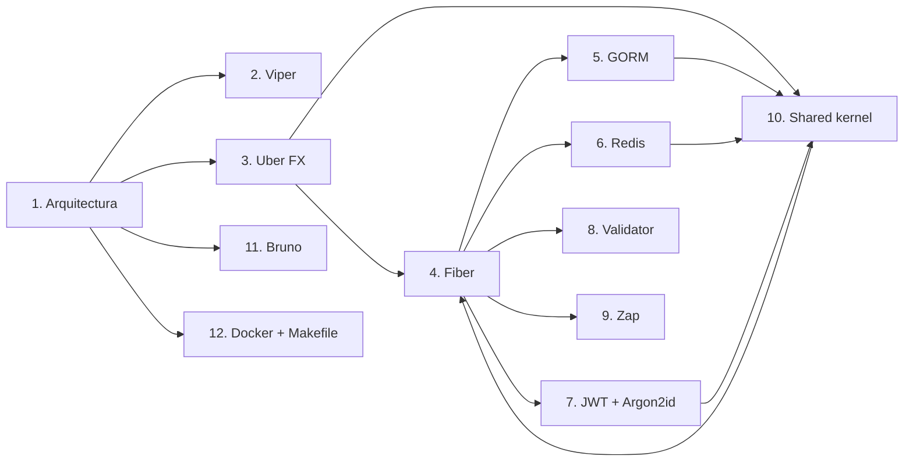

---
tags:
  - go
  - backend
  - indice
aliases:
  - Backend en Go
  - Stack Go backend
---

# Backend en Go

Apuntes para construir una API REST en Go con un stack moderno de producción: **Fiber v2** como framework HTTP, **GORM + PostgreSQL** como persistencia, **Redis** como caché, **JWT + Argon2id** para autenticación, **Uber FX** para inyección de dependencias y **Viper** para configuración. Todo organizado con una arquitectura de **vertical slices** y un núcleo compartido (`internal/shared`).

Los conceptos base del lenguaje están en [[0. Indice|Fundamentos de Go]].

## Tech Stack

| Tecnología | Uso | Librería |
| --- | --- | --- |
| **Go 1.25+** | Lenguaje y herramienta de build | — |
| **Fiber v2** | Framework HTTP (router + middleware) | `github.com/gofiber/fiber/v2` |
| **GORM + PostgreSQL** | ORM y base de datos | `gorm.io/gorm`, `gorm.io/driver/postgres` |
| **Redis** | Caché y datos temporales | `github.com/redis/go-redis/v9` |
| **JWT (HS256)** | Tokens de sesión | `github.com/golang-jwt/jwt/v5` |
| **Argon2id** | Hash seguro de contraseñas | `golang.org/x/crypto/argon2` |
| **Uber FX** | Inyección de dependencias | `go.uber.org/fx` |
| **Viper** | Configuración (YAML + variables de entorno) | `github.com/spf13/viper` |
| **Zap** | Logging estructurado | `go.uber.org/zap` |
| **Validator v10** | Validación de requests | `github.com/go-playground/validator/v10` |
| **Bruno** | Cliente y colecciones de API | App de escritorio + CLI `bru` |

## Estructura del proyecto

```
.
├── cmd/
│   ├── server/          # Main HTTP server
│   └── migrate/         # Database migration tool
├── configs/
│   └── config.yaml      # Configuration file
├── deployments/
│   └── docker/          # Docker Compose, Dockerfiles
├── docs/
│   └── api/             # API documentation
├── internal/
│   ├── modules/         # Vertical slice modules
│   │   ├── tenant/
│   │   ├── company/
│   │   ├── user/
│   │   ├── auth/
│   │   ├── product/
│   │   ├── inventory/
│   │   ├── sales/
│   │   ├── pharmacy/
│   │   ├── minimarket/
│   │   ├── hardware/
│   │   └── dashboard/
│   └── shared/          # Shared kernel
│       ├── config/
│       ├── database/
│       ├── errors/
│       ├── logger/
│       ├── middleware/
│       ├── validator/
│       ├── pagination/
│       ├── response/
│       ├── security/
│       ├── jwt/
│       ├── events/
│       ├── clock/
│       └── transaction/
├── pkg/
│   └── container/       # FX container wiring
├── bruno/               # Bruno API collections
├── go.mod
├── go.sum
├── Makefile
└── .env.example
```

> [!info] Por qué esta estructura
> - `cmd/` → puntos de entrada del binario (uno por comando).
> - `internal/` → código privado que no debe importarse fuera del proyecto.
> - `modules/` → cada feature vive en su propia "rebanada vertical" (handler, servicio, repo juntos).
> - `shared/` → núcleo compartido que los módulos reutilizan sin acoplarse entre sí.
> - `pkg/` → lo único pensado para ser importado por otros (aquí, el wiring de FX).
> - `bruno/` → colecciones de API versionadas, como "documentación ejecutable".

## Contenido

### Arquitectura y entorno
- [[1. Arquitectura del proyecto]] — Vertical slices, flujo de una request y el shared kernel
- [[2. Configuración con Viper]] — `config.yaml` + variables de entorno + `.env.example`
- [[3. Inyección de dependencias con Uber FX]] — El contenedor que arma la aplicación

### Capas de la aplicación
- [[4. HTTP con Fiber v2]] — Rutas, grupos, middleware y handlers
- [[5. Persistencia con GORM y PostgreSQL]] — Modelos, repositorios y migraciones
- [[6. Caché con Redis]] — Cache-aside, TTL y datos de sesión
- [[7. Autenticación con JWT y Argon2id]] — Tokens HS256 y hash de contraseñas
- [[8. Validación con Validator v10]] — Tags, reglas y errores de validación
- [[9. Logging con Zap]] — Logs estructurados en producción
- [[10. Shared kernel: respuestas, errores y paginación]] — El contrato común de la API

### Tooling y despliegue
- [[11. Cliente de APIs con Bruno]] — Colecciones, entornos y pruebas
- [[12. Docker, Makefile y migraciones]] — Compose, builds multi-stage y `cmd/migrate`

## Mapa de relaciones



**Ver también:** [[0. Indice|Fundamentos de Go]] | `Material/Go/Code` (ejercicios de práctica)