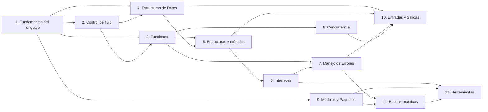

---
tags:
  - go
  - fundamentals
  - indice
aliases:
  - Fundamentos de Go
  - Go básico
---

# Fundamentos de Go

Apuntes de los fundamentos del lenguaje Go, ordenados como una ruta de aprendizaje. Cada nota enlaza con las que necesita como requisito y con las que amplían su tema: puedes seguir el orden numérico o saltar entre notas según lo que busques.

## Contenido

### Nivel 1 — Las bases del lenguaje
- [[1. Fundamentos del lenguaje]] — Estructura de un programa, tipos, variables y operadores
- [[2. Control de flujo]] — Condicionales, bucles, `break` y `continue`
- [[3. Funciones]] — Declaración, retornos múltiples, anónimas, closures

### Nivel 2 — Datos y composición
- [[4. Estructuras de Datos]] — Arrays, slices, maps y strings
- [[5. Estructuras y métodos]] — `struct`, métodos y receptores
- [[6. Interfaces]] — Abstracción y polimorfismo

### Nivel 3 — Robustez y concurrencia
- [[7. Manejo de Errores]] — `error`, errores personalizados, `panic`/`recover`
- [[8. Go Rutines y Concurrencia]] — Goroutines, canales, `select` y `sync.WaitGroup`

### Nivel 4 — Proyectos reales
- [[9. Módulos y Paquetes]] — `go mod`, estructura de proyecto y dependencias
- [[10. Entradas y Salidas]] — Consola, archivos y JSON
- [[11. Buenas practicas]] — Convenciones, `go fmt` y documentación
- [[12. Herramientas y Librerías Útiles]] — Comandos, análisis estático y librerías

## Mapa de relaciones

| Nota | Requiere (lee antes) | Se conecta con (lee después) |
| --- | --- | --- |
| [[1. Fundamentos del lenguaje]] | — | [[2. Control de flujo]], [[3. Funciones]], [[4. Estructuras de Datos]], [[9. Módulos y Paquetes]] |
| [[2. Control de flujo]] | [[1. Fundamentos del lenguaje]] | [[3. Funciones]], [[4. Estructuras de Datos]] |
| [[3. Funciones]] | [[1. Fundamentos del lenguaje]], [[2. Control de flujo]] | [[5. Estructuras y métodos]], [[7. Manejo de Errores]], [[8. Go Rutines y Concurrencia]] |
| [[4. Estructuras de Datos]] | [[1. Fundamentos del lenguaje]], [[3. Funciones]] | [[5. Estructuras y métodos]], [[10. Entradas y Salidas]] |
| [[5. Estructuras y métodos]] | [[3. Funciones]], [[4. Estructuras de Datos]] | [[6. Interfaces]], [[10. Entradas y Salidas]] |
| [[6. Interfaces]] | [[5. Estructuras y métodos]] | [[7. Manejo de Errores]], [[12. Herramientas y Librerías Útiles]] |
| [[7. Manejo de Errores]] | [[3. Funciones]], [[6. Interfaces]] | [[10. Entradas y Salidas]], [[11. Buenas practicas]] |
| [[8. Go Rutines y Concurrencia]] | [[3. Funciones]], [[2. Control de flujo]] | [[10. Entradas y Salidas]] |
| [[9. Módulos y Paquetes]] | [[1. Fundamentos del lenguaje]] | [[11. Buenas practicas]], [[12. Herramientas y Librerías Útiles]] |
| [[10. Entradas y Salidas]] | [[5. Estructuras y métodos]], [[7. Manejo de Errores]], [[4. Estructuras de Datos]] | proyectos reales → [[0. Backend]] |
| [[11. Buenas practicas]] | [[9. Módulos y Paquetes]], [[7. Manejo de Errores]] | [[12. Herramientas y Librerías Útiles]] |
| [[12. Herramientas y Librerías Útiles]] | [[9. Módulos y Paquetes]], [[11. Buenas practicas]] | proyectos reales → [[0. Backend]] |

---

**Ver también:** [[0. Backend]] (siguiente nivel: proyectos reales con Fiber, GORM, Redis y Docker)